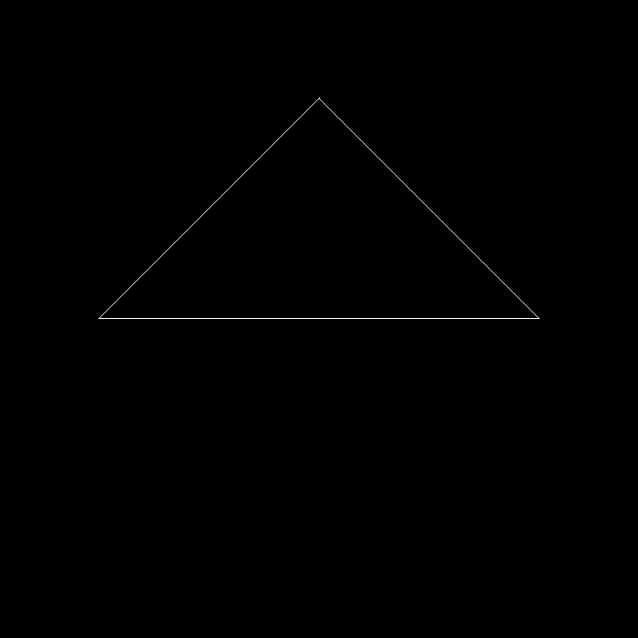
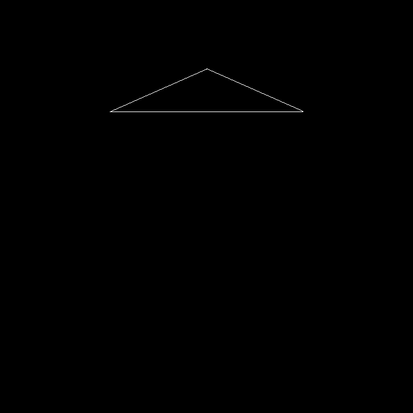

# GAMES101-Assignment1

## get_projection_matrix

`zNear` and `zFar` should be negative, if not the triangle will be upside down.

## rotation with any axis

bonus is completed but it seems strange.

## Without rotation and camera at (0, 0, 5)

## Rotate 80 degrees along (1, 0, 0) and camera at (0, 0, 10)

