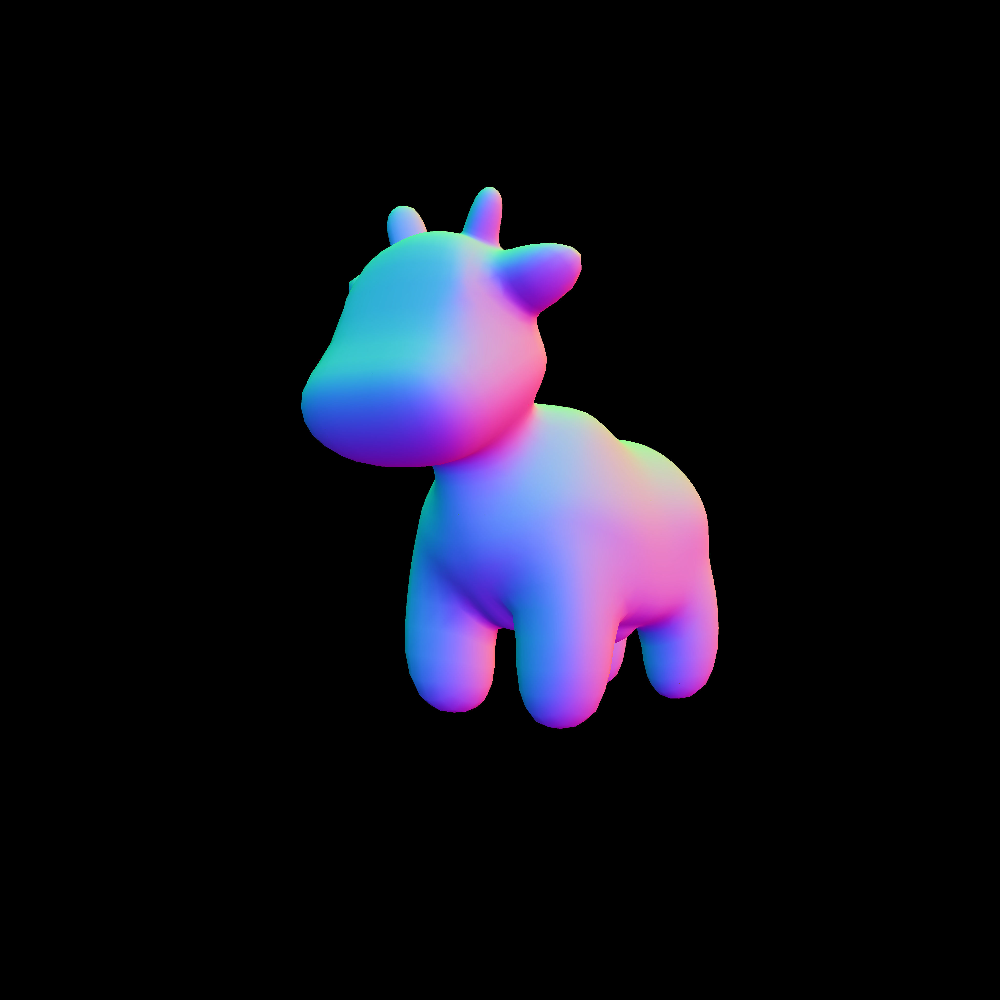
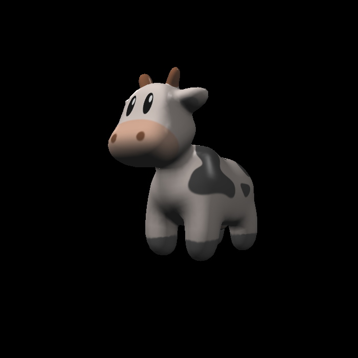
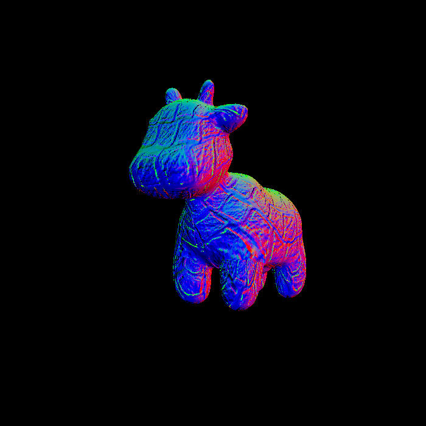
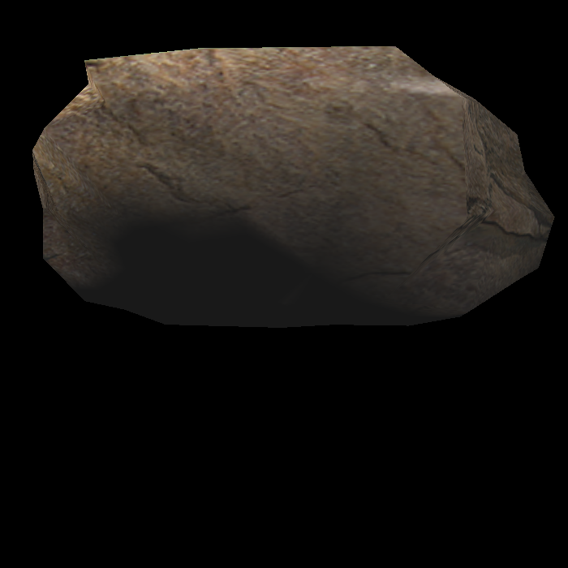
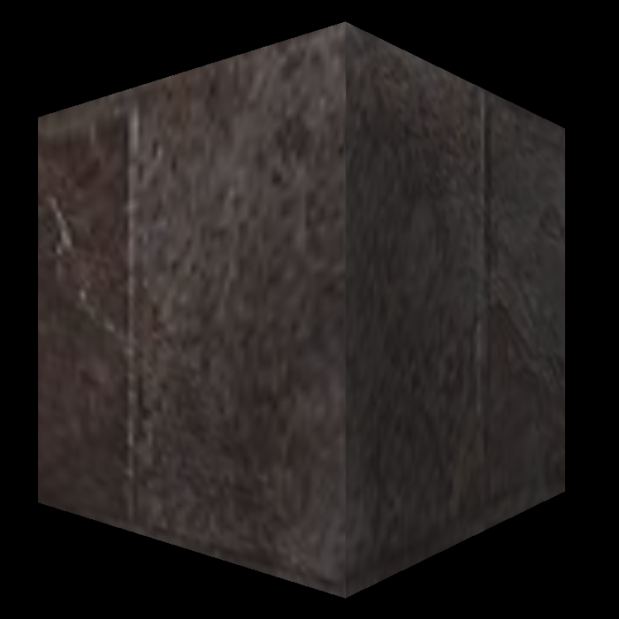
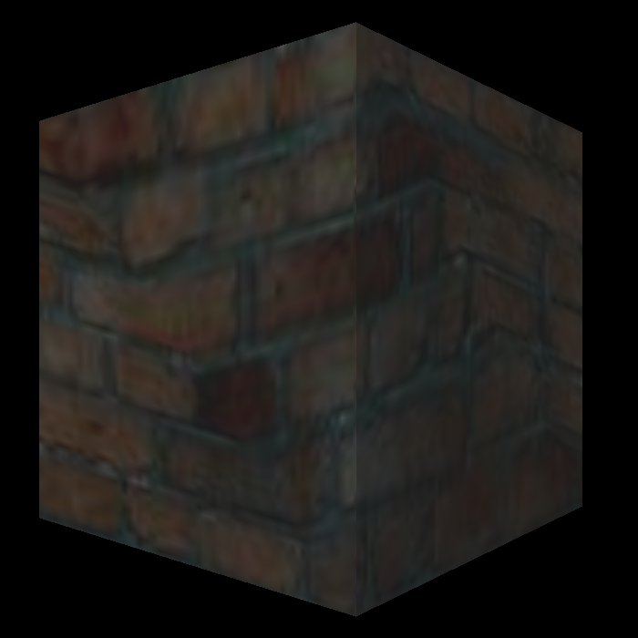
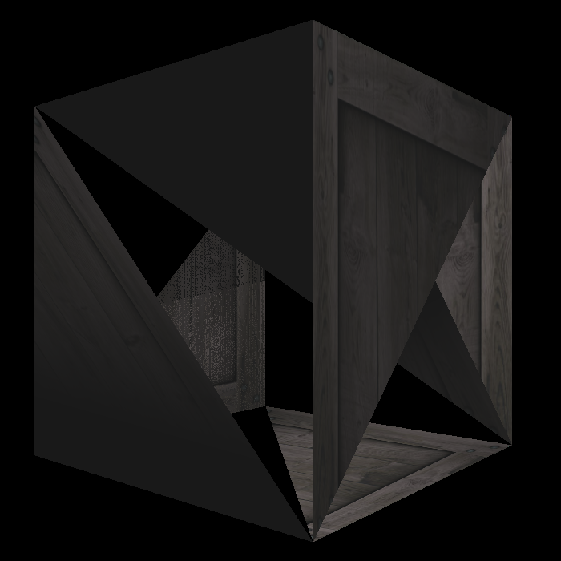
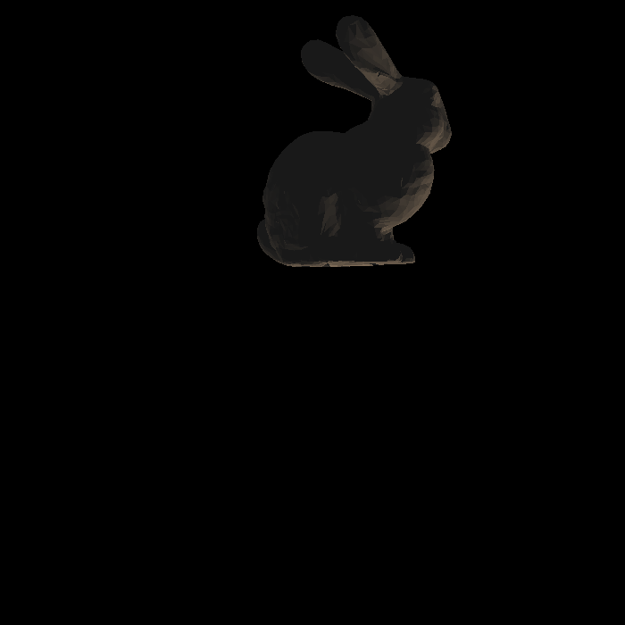

# GAMES101-Assignment3

## Normal Shader

## Normal Shader with 1920x1920

## Blinn-Phong Shader

## Normal Texture Shader

## Bilinear Texture Shader 

## Normal Texture Shader with 7680x7680

## Bilinear Texture Shader with 7680x7680

## Bump Mapping

## Displacement Mapping

## Rock

## Cube with texture1

## Cube with texture2

## Crate

## Bunny with Blinn-Phong

