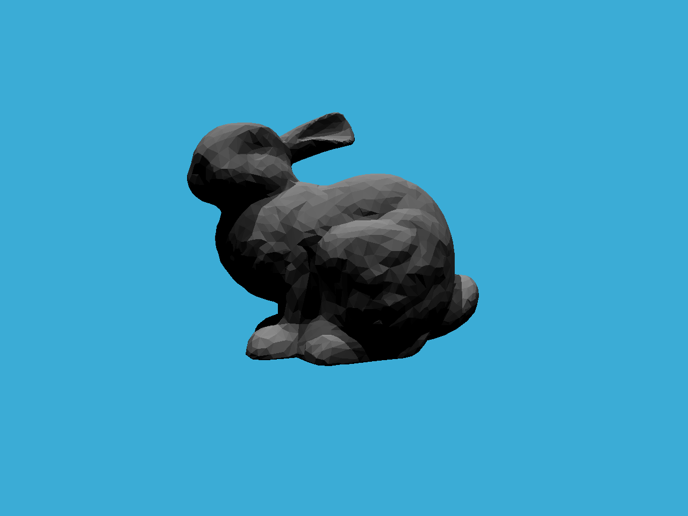

# GAMES101-Assignment6

## Caution

Intersections with triangles and bounds produce different results because intersections with triangles lead to large precision errors. View details in `getIntersection` from `BVH.cpp`.

## Whitted-Style Ray Tracing with Naive Method

### Output

#### Naive

```
BVH Generation complete: 
Time Taken: 0 hrs, 0 mins, 0 secs

 - Generating BVH...

BVH Generation complete: 
Time Taken: 0 hrs, 0 mins, 0 secs

Render complete: ======================================================] 100 %
Time taken: 0 hours
          : 0 minutes
          : 6 seconds
```

#### Optimization of `BVHAccel::getIntersection`

Recur the child whose `t_enter` of its bound is smaller first. 

Then if the `t_enter` of another child is bigger than the current result, continue.

```
BVH Generation complete: 
Time Taken: 0 hrs, 0 mins, 0 secs

 - Generating BVH...

BVH Generation complete: 
Time Taken: 0 hrs, 0 mins, 0 secs

Render complete: ======================================================] 100 %
Time taken: 0 hours
          : 0 minutes
          : 5 seconds
```

#### Advanced Optimization of `BVHAccel::getIntersection`

Use the global optimal solution to prune

```
BVH Generation complete: 
Time Taken: 0 hrs, 0 mins, 1 secs

 - Generating BVH...

BVH Generation complete: 
Time Taken: 0 hrs, 0 mins, 0 secs

Render complete: ======================================================] 100 %
Time taken: 0 hours
          : 0 minutes
          : 4 seconds
```

### Rendering Result



